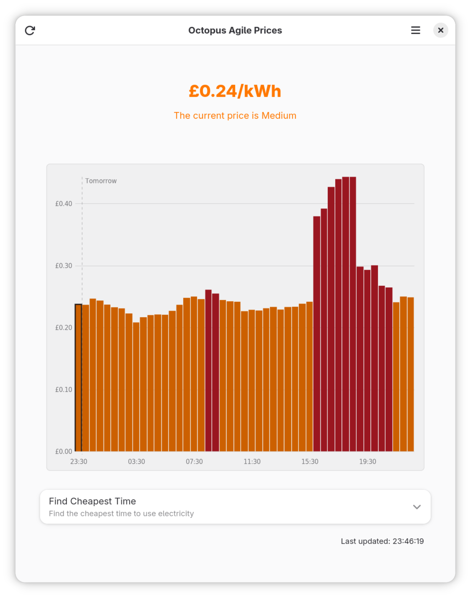

# Agile Rates

This is a modern GNOME application built to track and visualise UK smart electricity tariff rates in real time. It fetches current and forecast half-hourly prices across supported Octopus Energy tariffs, helping users quickly see the best times to use electricity. It is intended for UK Octopus Energy customers, but is independent and is not affiliated with, endorsed by, or sponsored by Octopus Energy.

* **Current Price Display:** Shows the real-time electricity price (pence/kWh).
* **Price Level Indicators:** Visually indicates whether the current price is low, medium, high, or even negative.
* **Adaptive Price Forecast Chart:** Displays a bar chart of upcoming half-hourly price data, adapting the visible horizon to the available space while keeping small-screen layouts usable.
* **Find Cheapest Time:** A built-in calculator to find the cheapest time window for a specific duration (e.g., "find the cheapest 3 hours in the next 24 hours").
* **Region and Tariff Selection:** Allows users to select their region and tariff through a preferences window. Supports Agile, Go, and Intelligent Go tariffs. Intelligent Go needs a user-provided API key.
* **Adaptive GTK Interface:** The main window and preferences window now adapt more cleanly across narrow and wide GTK layouts.



## Development

This application targets GNOME 50 and is best developed through the Flatpak SDK. That keeps GTK, libadwaita, Python, Meson, and native tooling in the same environment used to build the app.

### Prerequisites

Install Flatpak and Flatpak Builder, then install the GNOME 50 runtime and SDK if your system does not already have them:

```bash
flatpak install flathub org.gnome.Platform//50 org.gnome.Sdk//50
```

### Flatpak Test And Debug Loop

The development manifest builds from the local checkout and runs the Meson test suite inside the GNOME SDK sandbox:

```bash
flatpak-builder --user --install --force-clean build-dir com.nedrichards.octopusagile.Devel.json
flatpak run com.nedrichards.octopusagile.Devel
```

The `octopusagile` module in `com.nedrichards.octopusagile.Devel.json` has `run-tests` enabled, so the build fails if `meson test` fails inside the Flatpak environment.

If `rofiles-fuse` is not usable in your development environment, add Flatpak Builder's fallback flag:

```bash
flatpak-builder --disable-rofiles-fuse --user --install --force-clean build-dir com.nedrichards.octopusagile.Devel.json
```

For a one-off command inside the built sandbox, run:

```bash
flatpak-builder --run build-dir com.nedrichards.octopusagile.Devel.json sh
```

Useful commands from that shell:

```bash
meson test -C /run/build/octopusagile/_flatpak_build --print-errorlogs
com.nedrichards.octopusagile
python3 -m compileall /app
G_MESSAGES_DEBUG=all com.nedrichards.octopusagile
```

To inspect logs from an installed run:

```bash
journalctl --user -f
flatpak run com.nedrichards.octopusagile.Devel
```

To clear local app settings while debugging first-run behavior:

```bash
flatpak run --command=sh com.nedrichards.octopusagile.Devel
gsettings reset-recursively com.nedrichards.octopusagile
```

### Host-Side Fast Checks

Host-side checks are optional. They are useful for quick iteration on pure Python logic, but the Flatpak build is the authoritative environment.

```bash
python3 -m pip install -r requirements-dev.txt
python3 -m pytest
python3 -m ruff check src tests
```

If you want to run Meson on the host, use a separate local build directory named `build` so it does not collide with Flatpak Builder output:

```bash
meson setup build
meson test -C build --print-errorlogs
```

The `build` directory is reserved for host Meson tests. `build-dir` is reserved for Flatpak Builder output.

### GNOME Builder

GNOME Builder can also build and run the project through Flatpak. Open the checkout, select the `com.nedrichards.octopusagile.Devel.json` configuration for local development, then use Builder's Run action.

### Production Manifest

`com.nedrichards.octopusagile.json` builds from a pinned upstream Git commit for release-style packaging. `com.nedrichards.octopusagile.Devel.json` builds from the local checkout and is the right manifest for active development.

To build and run the pinned production manifest:

```bash
flatpak-builder --user --install --force-clean build-dir com.nedrichards.octopusagile.json
flatpak run com.nedrichards.octopusagile
```

## Usage

Upon first launch, the application opens the Preferences window so you can choose the correct tariff and region before fetching prices.

### Configuration

To change your region or tariff:
1.  Click the menu button in the top-right corner of the application window.
2.  Select **Preferences**.
3.  Choose your desired tariff type, region, and tariff from the available selectors.

The application will automatically refresh the price data when settings are changed.

## License

This project is licensed under the GNU General Public License v3.0 or later (GPL-3.0-or-later).

## AI Assistance

Development of this project has been assisted by a variety of AI coding tools.
