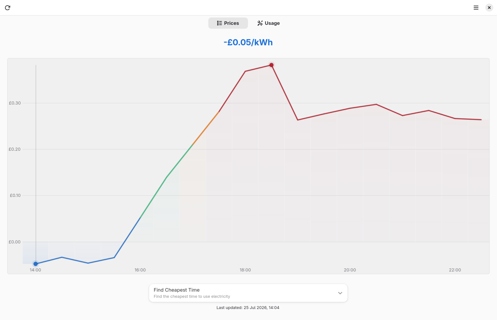

# Agile Rates

This is a modern GNOME application built to track and visualise UK smart electricity tariff rates in real time. It fetches current and forecast half-hourly prices across supported Octopus Energy tariffs, helping users quickly see the best times to use electricity. It is intended for UK Octopus Energy customers, but is independent and is not affiliated with, endorsed by, or sponsored by Octopus Energy.

* **Current Price Display:** Shows the real-time electricity price (pence/kWh).
* **Price Level Indicators:** Visually indicates whether the current price is low, medium, high, or even negative.
* **Adaptive Price Forecast Chart:** Displays upcoming half-hourly price data in a horizontally scrollable chart while keeping small-screen layouts usable.
* **Find Cheapest Time:** A built-in calculator to find the cheapest time window for a specific duration, including half-hour appliance runs such as "3h 30m in the next 24 hours".
* **Region and Tariff Selection:** Allows users to select their region and tariff through a preferences window. You can choose a region manually, connect an Octopus account to infer its tariff and region, or use device location to identify the region locally. Supports Agile, Go, Intelligent Go, and dual-register day/night tariffs. Intelligent Go needs a user-provided API key.
* **Usage History:** Shows recent smart meter usage and estimated spend when an API key and account number are configured, with clear setup and loading states when account access is not available yet.
* **Adaptive GTK Interface:** The main window and preferences window now adapt more cleanly across narrow and wide GTK layouts.



## Development

This application targets GNOME 50 and is best developed through the Flatpak SDK. That keeps GTK, libadwaita, Python, Meson, and native tooling in the same environment used to build the app.

### Prerequisites

Install Flatpak and Flatpak Builder, then install the GNOME 50 runtime and SDK if your system does not already have them:

```bash
flatpak install flathub org.gnome.Platform//50 org.gnome.Sdk//50
```

### Flatpak Test And Debug Loop

The development manifest builds from the local checkout and runs the Meson test suite inside the GNOME SDK sandbox:

```bash
flatpak-builder --user --install --force-clean build-dir com.nedrichards.octopusagile.Devel.json
flatpak run com.nedrichards.octopusagile.Devel
```

The `octopusagile` module in `com.nedrichards.octopusagile.Devel.json` has `run-tests` enabled, so the build fails if `meson test` fails inside the Flatpak environment.

If `rofiles-fuse` is not usable in your development environment, add Flatpak Builder's fallback flag:

```bash
flatpak-builder --disable-rofiles-fuse --user --install --force-clean build-dir com.nedrichards.octopusagile.Devel.json
```

For a one-off command inside the built sandbox, run:

```bash
flatpak-builder --run build-dir com.nedrichards.octopusagile.Devel.json sh
```

Useful commands from that shell:

```bash
meson test -C /run/build/octopusagile/_flatpak_build --print-errorlogs
com.nedrichards.octopusagile
python3 -m compileall /app
G_MESSAGES_DEBUG=all com.nedrichards.octopusagile
```

To inspect logs from an installed run:

```bash
journalctl --user -f
flatpak run com.nedrichards.octopusagile.Devel
```

To clear local app settings while debugging first-run behavior:

```bash
flatpak run --command=sh com.nedrichards.octopusagile.Devel
gsettings reset-recursively com.nedrichards.octopusagile
```

### SDK Source Checks

Run source checks inside the GNOME SDK rather than against the host Python and GTK stack. The installed development build supplies the same pinned Python dependencies used by the application; install the development-only tools into a temporary SDK path first.

```bash
flatpak run --command=sh --filesystem="$PWD" --share=network org.gnome.Sdk//50
python3 -m pip install --target=/tmp/octopusagile-test-tools -r requirements-dev.txt
PYTHONPATH=/tmp/octopusagile-test-tools:$PWD/build-dir/files/lib/python3.13/site-packages python3 -m compileall -q src tests
PYTHONPATH=/tmp/octopusagile-test-tools:$PWD/build-dir/files/lib/python3.13/site-packages python3 -m ruff check src tests
PYTHONPATH=/tmp/octopusagile-test-tools:$PWD/build-dir/files/lib/python3.13/site-packages python3 -m pytest
```

The Python minor-version directory follows the GNOME SDK and can change when the runtime is upgraded. The authoritative `flatpak-builder` command above runs the Meson unit suite automatically without this extra setup.

### Profiling

Install your distribution's Sysprof package, then capture a representative run of the development Flatpak. Exercise the workspace switcher, chart selection, window resizing, and usage view before closing the app so Sysprof finishes the capture.

```bash
sysprof-cli --force --gtk --speedtrack --scheduler --no-debuginfod \
  /tmp/octopusagile.syscap -- \
  flatpak run com.nedrichards.octopusagile.Devel
```

### GNOME Builder

GNOME Builder can also build and run the project through Flatpak. Open the checkout, select the `com.nedrichards.octopusagile.Devel.json` configuration for local development, then use Builder's Run action.

### Production Manifest

`com.nedrichards.octopusagile.json` builds from a pinned upstream Git commit for release-style packaging. `com.nedrichards.octopusagile.Devel.json` builds from the local checkout and is the right manifest for active development.

To build and run the pinned production manifest:

```bash
flatpak-builder --user --install --force-clean build-dir com.nedrichards.octopusagile.json
flatpak run com.nedrichards.octopusagile
```

## Usage

Upon first launch, the application opens setup so you can choose the correct tariff and region before fetching prices. You can select a region manually, connect an Octopus account to infer its tariff and region, or choose **Use My Location** to ask the desktop location portal to identify your electricity region. Location is requested only when you press that button, is processed against bundled boundaries on your device, is not stored, and is never sent to Octopus Energy, Northern Powergrid, or another network service. You can use manual setup for current and upcoming prices, then add an Octopus API key and account number later to enable usage history and spend estimates.

The selected workspace, Plan duration, and search window are remembered between runs. In Plan, select any half-hour on the chart to compare the price of starting the same-duration run then with the cheapest result. Durations can be adjusted in 30-minute steps for appliances that do not run in whole hours, with appliance-timer options showing whole-hour start and finish values, exact windows, and price differences from the cheapest window. It stacks the result and chart on smaller windows, then uses a two-column chart-and-controls layout when more width is available.

### Account scope

Accounts with several properties or independent active electricity supplies are not currently supported. Account auto-detection uses the first active electricity tariff agreement returned by the Octopus API. Usage history uses the first active electricity meter point for which consumption is available and, where that meter point lists several meters, chooses the meter with the most returned samples. The app does not aggregate properties or independent supplies, and the selected tariff and usage may therefore depend on the API ordering for such accounts. Choose the tariff manually if necessary, but do not treat the usage or spend views as whole-account totals.

### Configuration

To change your region or tariff:
1.  Click the menu button in the top-right corner of the application window.
2.  Select **Preferences**.
3.  Choose your desired tariff type, region, and tariff from the available selectors.

The application will automatically refresh the price data when settings are changed.

## License

This project is licensed under the GNU General Public License v3.0 or later (GPL-3.0-or-later).

### GB electricity-region boundaries

The app bundles an offline WGS84 GeoJSON snapshot (obtained 2026-08-02) of Northern Powergrid Open Data's [All DNO Licence Area Boundaries](https://northernpowergrid.opendatasoft.com/explore/dataset/all_dno_boundaries/) dataset. Its [GeoJSON export URL](https://northernpowergrid.opendatasoft.com/api/explore/v2.1/catalog/datasets/all_dno_boundaries/exports/geojson) is recorded so the snapshot can be refreshed. No geometry simplification was applied; retained DNO names are explicitly mapped to the application's existing Octopus `_A`–`_P` region codes in `src/region_location.py`.

Data licence: [Northern Powergrid Open Data Licence v1.0](https://northernpowergrid.opendatasoft.com/p/opendatalicence/).

Required attribution: “Supported by Northern Powergrid Open Data”.

The complete data licence and provenance are in `data/NORTHERN_POWERGRID_OPEN_DATA_LICENCE_v1.0.txt` and `data/README.md`; both are installed with the app. The required attribution appears in the application About window. Northern Powergrid does not endorse this application, and no Northern Powergrid logos are used.

The application source code is licensed under GNU GPL version 3. The GeoJSON data in `data/` remains available under the Northern Powergrid Open Data Licence v1.0 and is not relicensed under GPLv3.

## AI Assistance

Development of this project has been assisted by a variety of AI coding tools.
